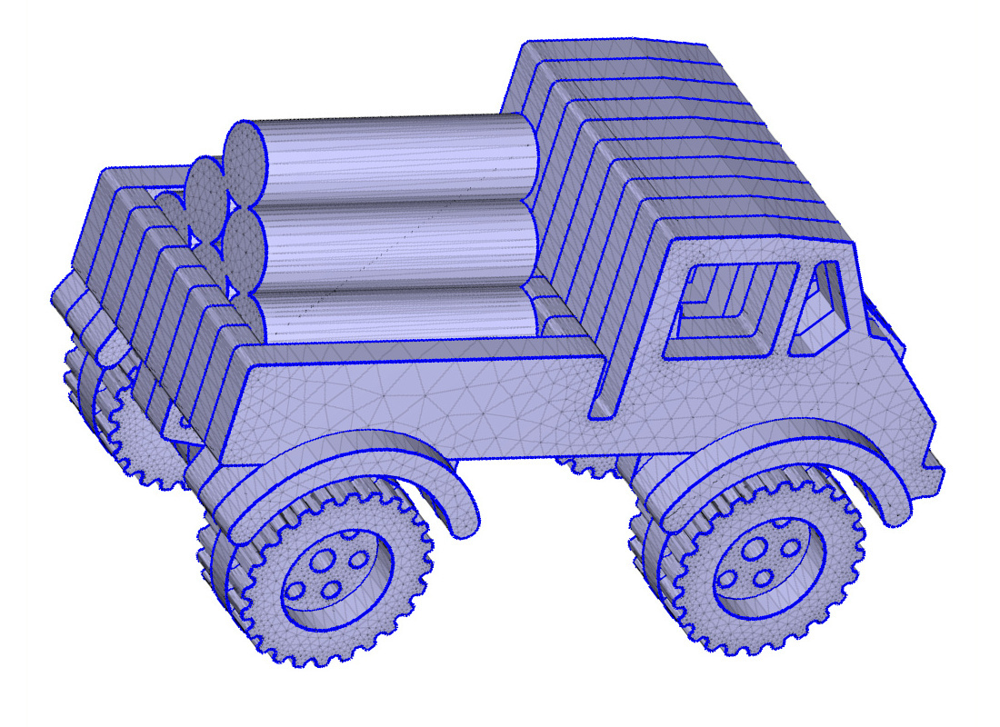
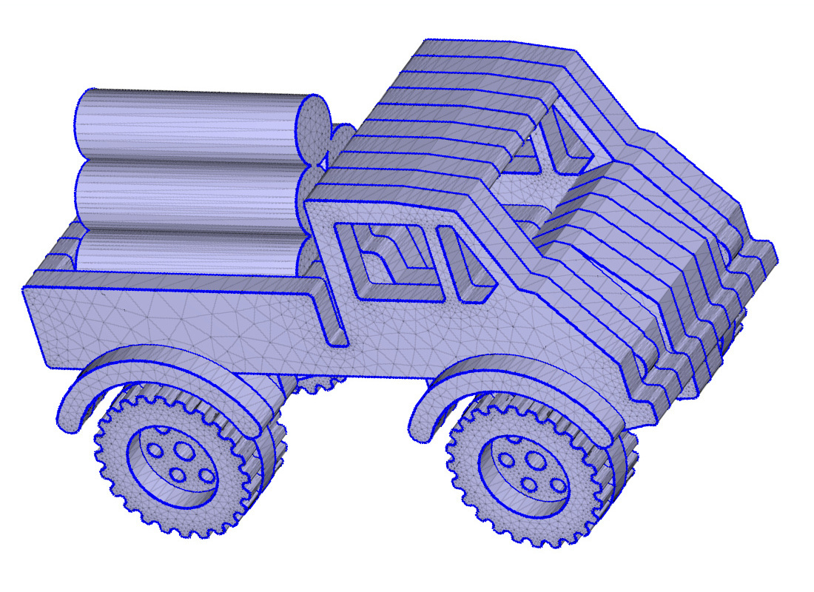
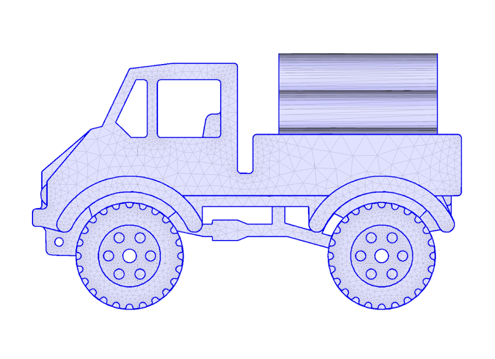
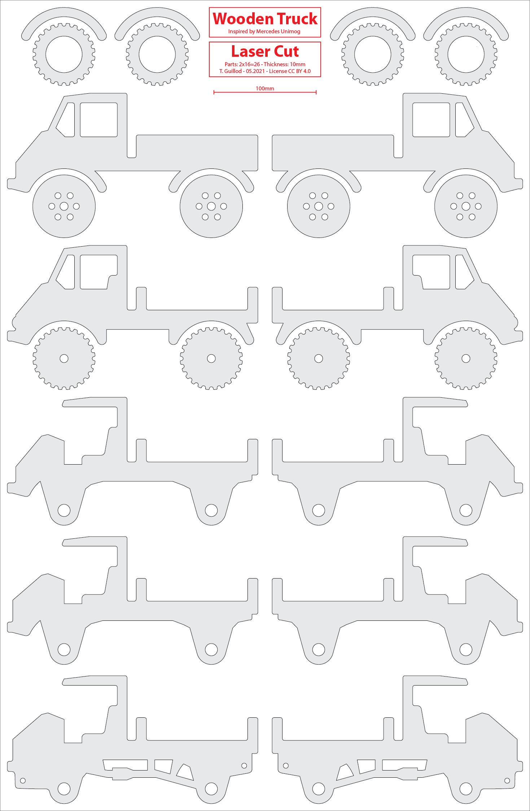
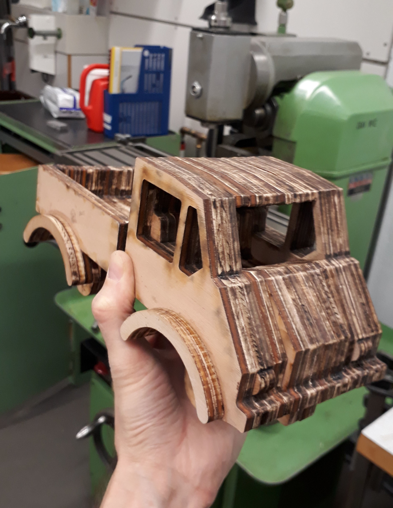
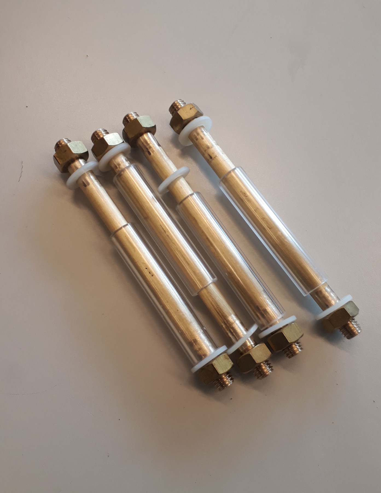
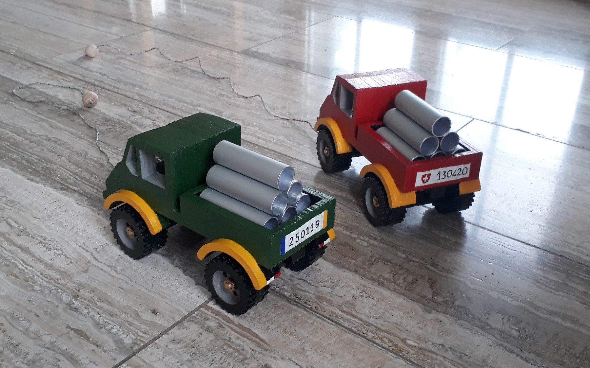
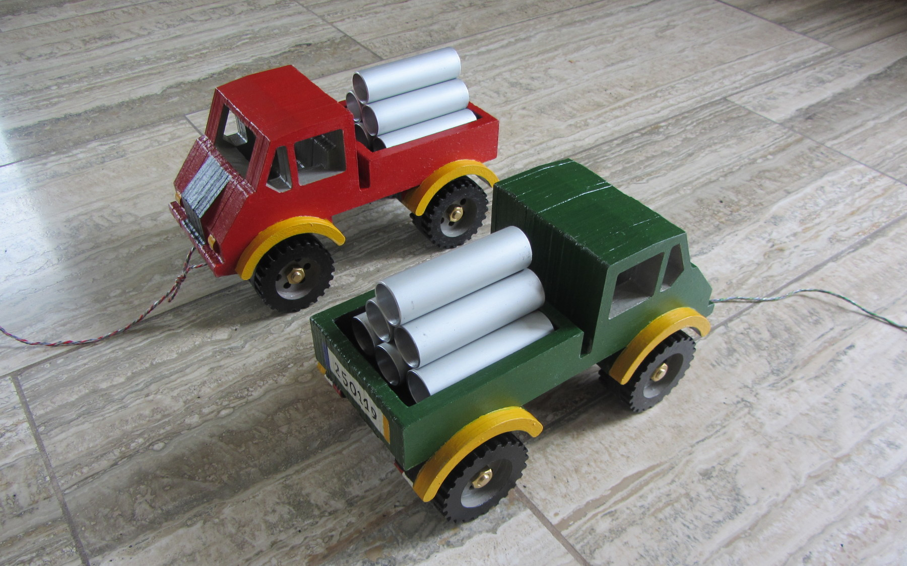
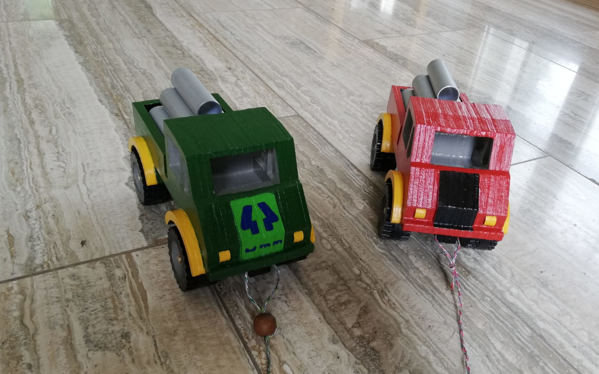

# Wooden Toy Truck / Laser Cut

* This **Wooden Toy Truck** is realized with **stacked laser cut plates**.
* The model is inspired by the **Mercedes Unimog**.
* The model is particularly **robust**.
* The toy size is around **25 cm**.

    
    
    

## Technical Drawing

* The toy is composed of 26 wooden pieces (10 mm thickness).
* The pieces are meant to be cut with a laser-cutter.
* Alternatively, a scroll saw or milling machine could be used.
* The different pieces are glued together.
* The wheel axles (8 mm diameter) can be constructed with wood or metal.
* The bearings are done with a plastic pipes (12/8 mm diameter).

    

    
    

* The PDF with the technical drawing is available in [wooden_truck_laser_cut.pdf](wooden_truck_laser_cut.pdf).
* A 3D preview (STL format) is available in [wooden_truck_laser_cut.stl](wooden_truck_laser_cut.stl).
* This model has been realized with the following tool: [laser_cut_matlab_slicer](https://github.com/otvam/laser_cut_matlab_slicer).

## Inspiration

This model is inspired by the "Wooden Toy Car Unimog" by LuRhe (CC BY 4.0).
You can download this version on [Thingiverse](https://www.thingiverse.com/thing:3289565).
Here are the main differences between the proposed model and LuRhe's version:
* A CNC milling machine is not required, all the pieces can be laser-cutted.
* The model is more robust. Small features have been removed or reinforced.
* The model is symmetric (between the right and left sides).
* A towing hook has been added on the front and back.

## Photos

    
    
    

## Author

**Thomas Guillod** - [GitHub Profile](https://github.com/otvam)

## License

* The model is licensed under the **Creative Commons — CC BY 4.0**, see [LICENSE.md](LICENSE.md).
